# Multi-functional Telegram Bot

Интерактивный и многофункциональный Telegram-бот, разработанный на базе современного асинхронного фреймворка `aiogram 3`.
Бот объединяет в себе развлекательные, образовательные и интеллектуальные инструменты для пользователей.

## 🚀 Основной функционал

* **Интеграция с ИИ (ChatGPT):** Умный чат-помощник, обрабатывающий запросы пользователей через официальный API OpenAI.
* **Интерактивные квизы (Quiz):** Модуль викторин с использованием состояний (FSM) для проверки знаний.
* **Модуль переводчика:** Быстрый перевод текста на различные языки.
* **Инлайн-режим:** Возможность использовать некоторые функции бота прямо в интерфейсе других чатов.
* **Интересные факты:** Модуль генерации случайных и увлекательных фактов для пользователей.

## 🛠 Стек технологий

* **Language:** Python 3.11+
* **Framework:** [aiogram 3.x](https://github.com/aiogram/aiogram) (Asynchronous Telegram Bot API)
* **API Integrations:** OpenAI API (GPT-3.5/4)
* **Environment Management:** `python-dotenv` (для безопасного хранения токенов в `.env`)
* **HTTP Client:** `httpx`

## 📁 Структура проекта

Проект реализован с использованием модульной архитектуры, разделяющей интерфейс (хэндлеры и клавиатуры) и бизнес-логику:

* `handlers/` — обработчики команд, текстовых сообщений и колбэков.
* `keyboards/` — сборщики Reply и Inline клавиатур, разделенные по фичам.
* `services/` — изолированная бизнес-логика и внешние интеграции (API OpenAI).
* `utils/` — вспомогательные утилиты, кастомные фильтры и middleware.
* `config.py` — конфигурационный файл для загрузки переменных окружения.

## 💻 Инсталляция и запуск

### 1. Клонирование репозитория

```bash
git clone https://github.com/TechFlowOne1/Tg-bot-1.git
cd Tg-bot-1
```

2. Настройка виртуального окружения
```bash
python -m venv .venv
.venv\Scripts\activate
```
3. Установка зависимостей
```bash
pip install -r requirements.txt
```

4. Настройка переменных окружения
```bash
token_telegram=ВАШ_ТЕЛЕГРАМ_ТОКЕН
OPENAI_API_KEY=ВАШ_ОПЕНАИ_ТОКЕН
```

5. Запуск бота
```bash
python main.py
```

## 📷 Скриншоты работы бота

<details>
<summary><b>Нажмите, чтобы развернуть и посмотреть скриншоты интерфейса</b></summary>

### 🏁 Запуск бота
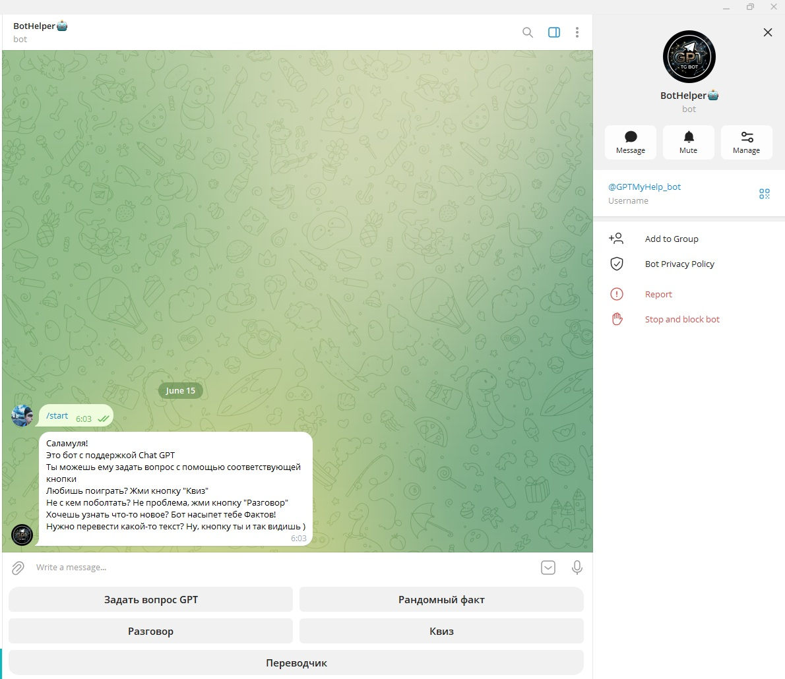

### 🧠 Чат с искусственным интеллектом (ChatGPT)
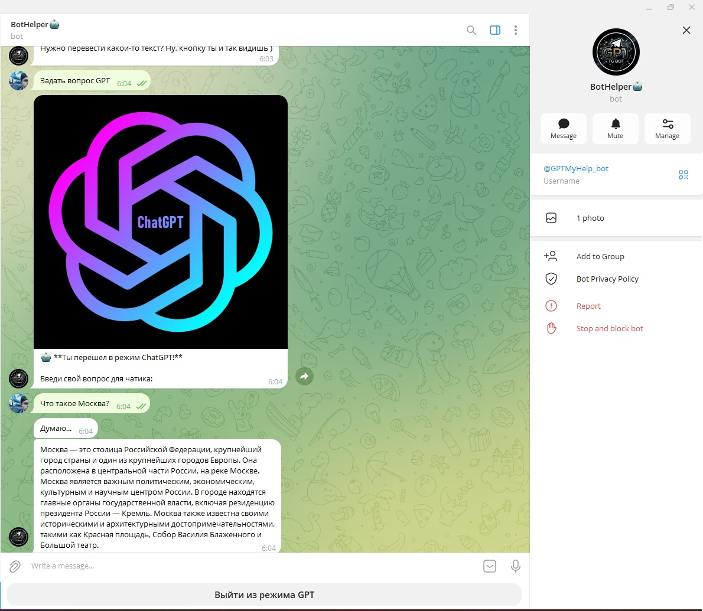

### 🎮 Интерактивный квиз (Викторина)
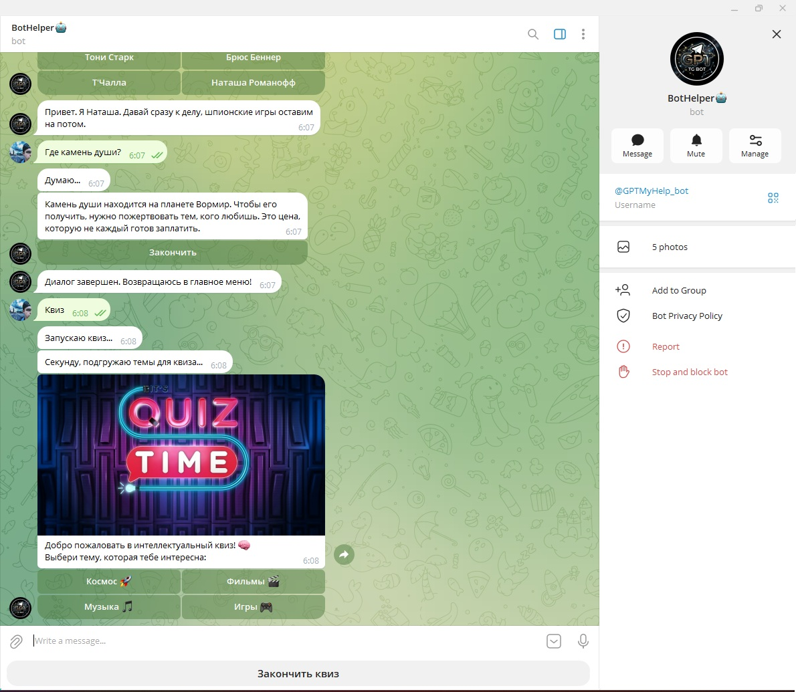
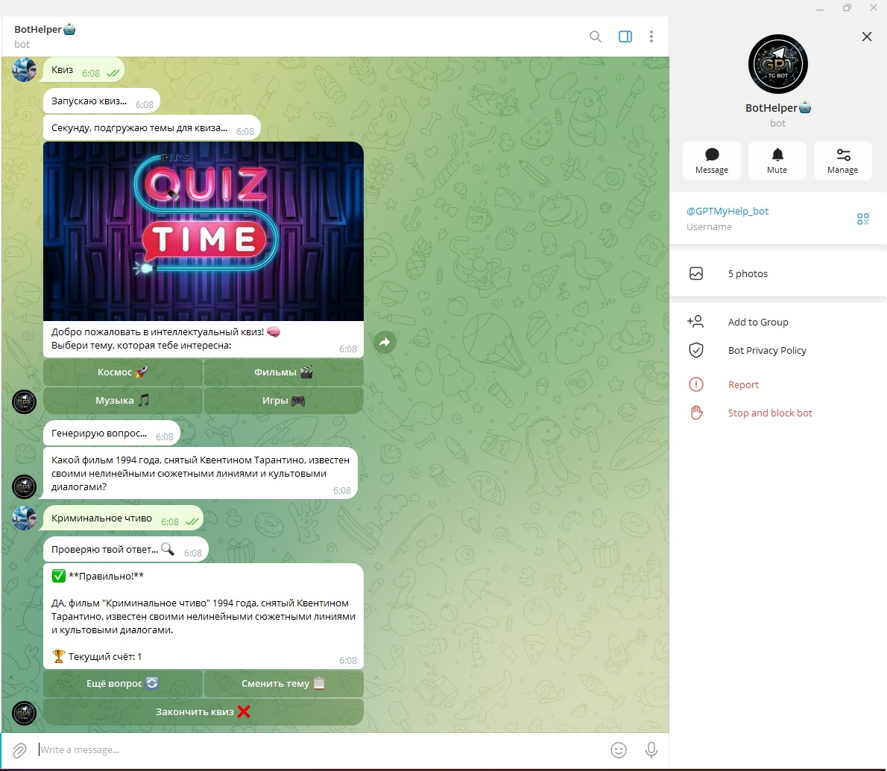
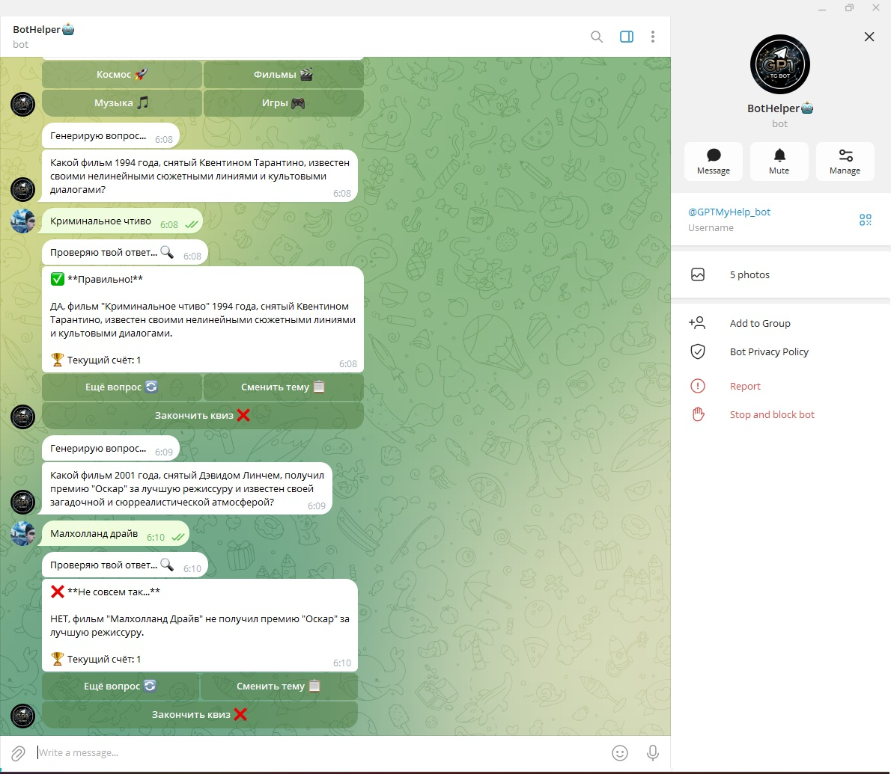
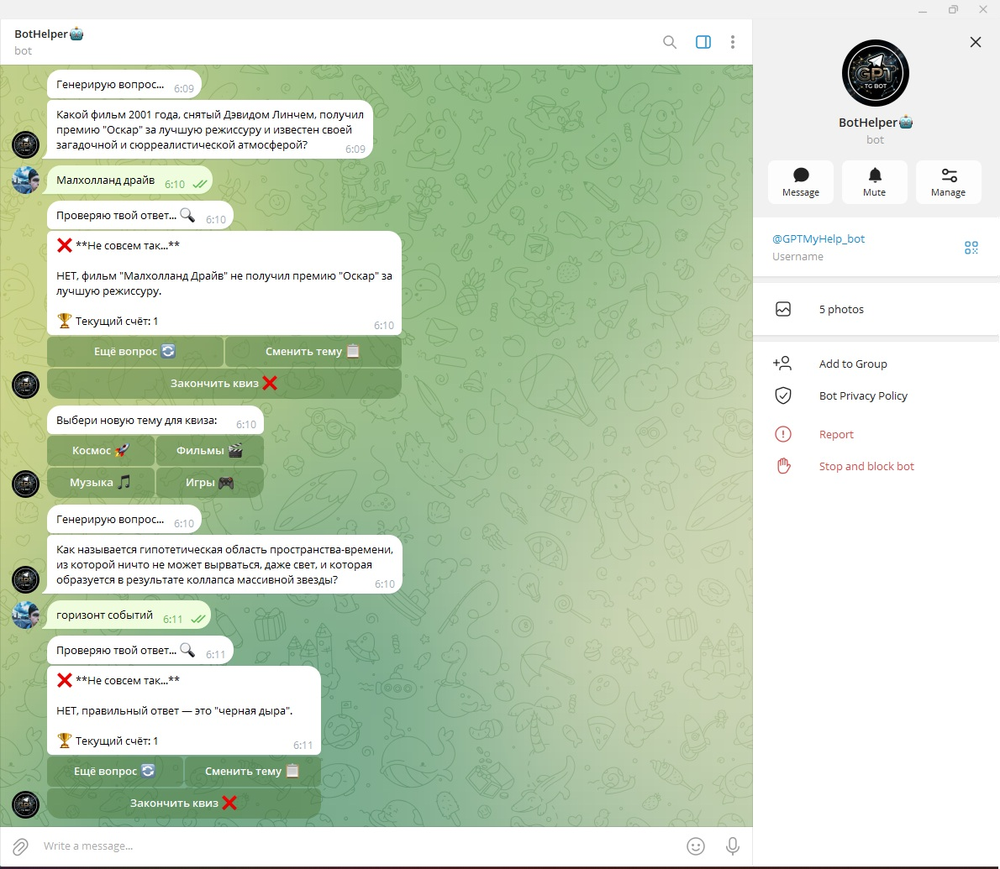

### 🌍 Модуль переводчика
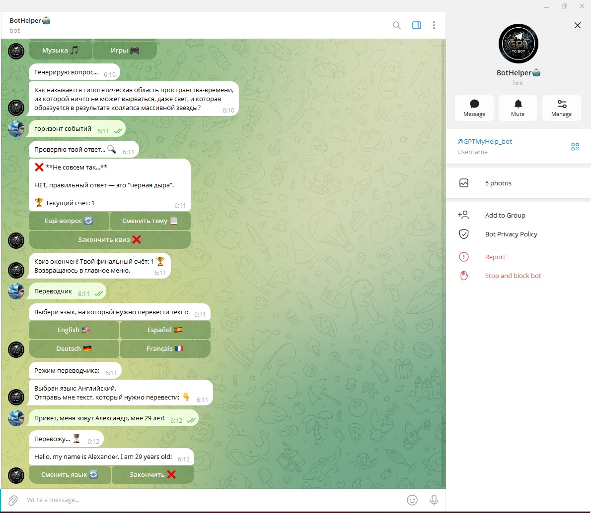
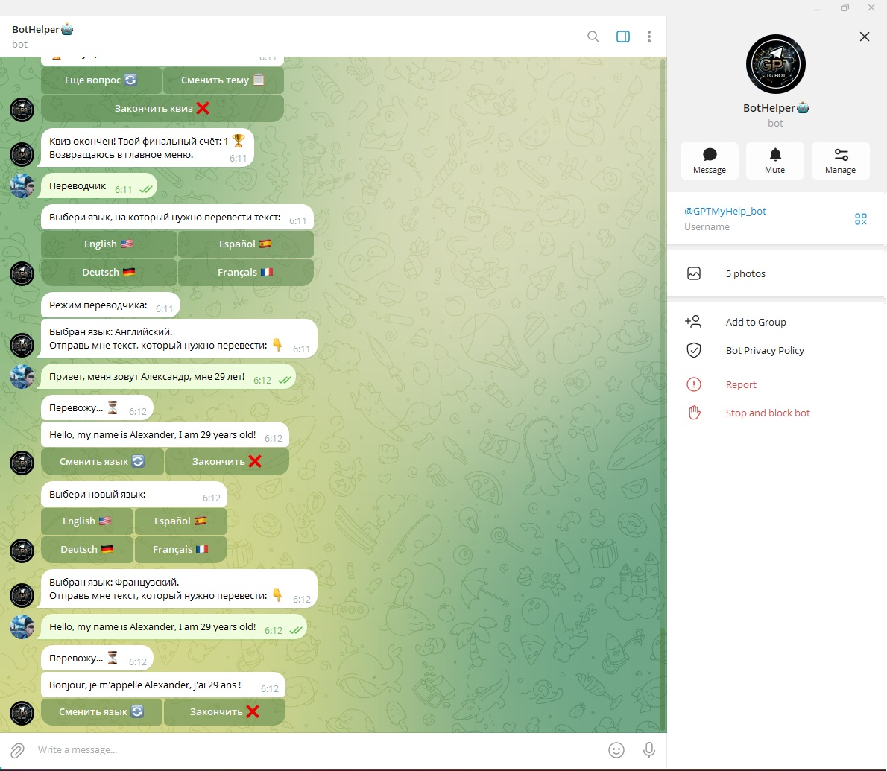

### 💡 Интересные факты
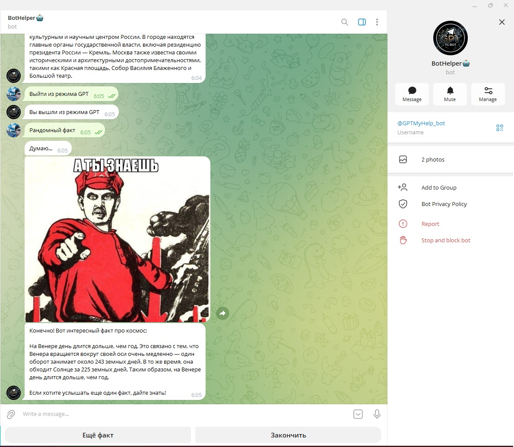
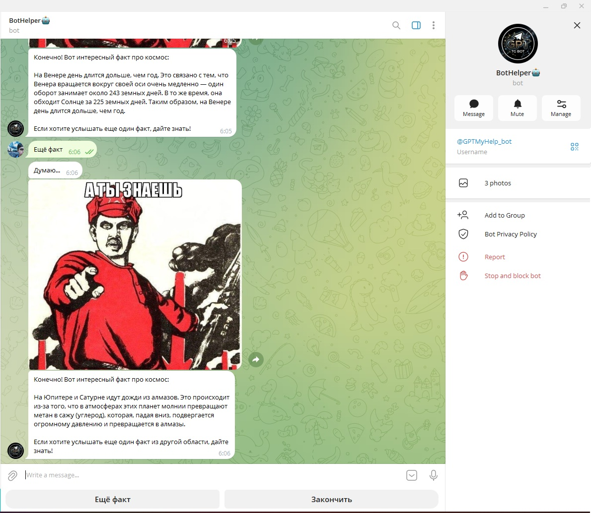

### 💻 Консоль разработчика
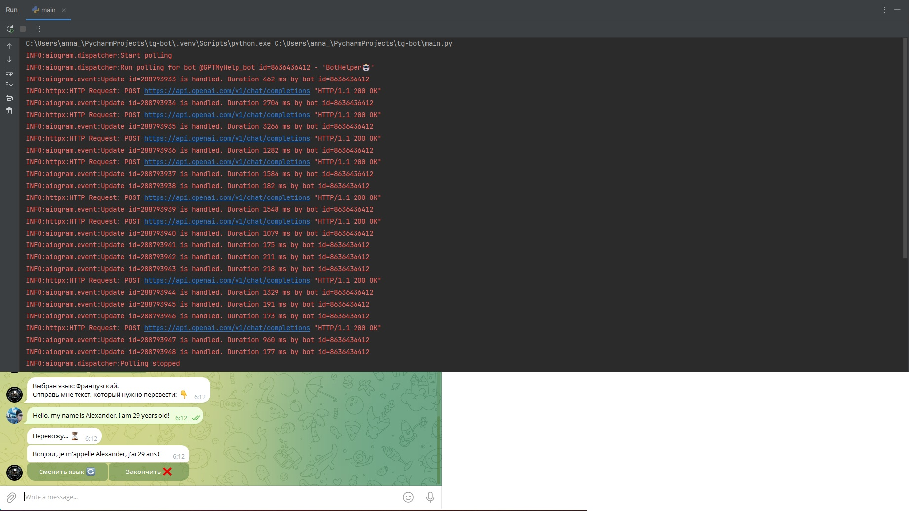

</details>